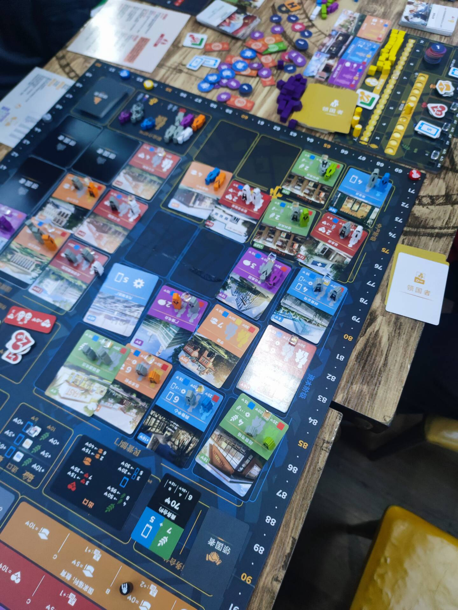
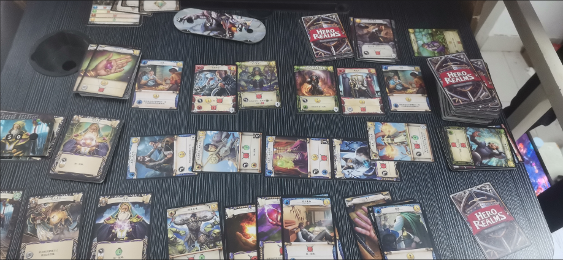
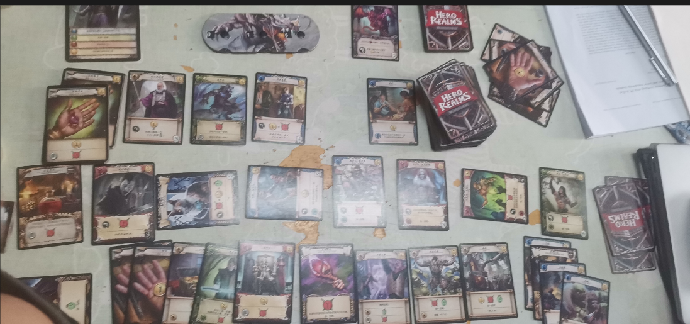

# 对一些桌游点评

## 领国者

2023.12.17 济南大学 八食  

我玩的**工人阶级**，最后113分取胜第一，感觉工人阶级罢工 效果不是很强力没法要挟人  

**中产阶级**自产自销活的很一个地主一样总体还是比较靠近资产阶级，中产这局因为把货物售价调整的比较高活的很没存在感  

**资产阶级**就比较简单了首先可以快速的往国外倒货，把握住人性的情况下可以最后在倒货毕竟国内的售价还是比国外高的，后期还是不要开太多工厂，动用人情世故哦打压无产阶级最后少交税就可以。  

**统治阶级**：国家的话还是比较无聊的首先5动中有2动是固定的处理事件，剩下3动基本就是人情世故谁弱帮谁，比容易破产。

## 英雄领域

2023.12.17 济大 宿舍

玩的冒险模式,使用的法师角色，第一个扩展的第一关，村的太多了(市场牌应该翻5张，把斗士当成仆从了)比较简单也可能是法师太强了，一血没掉就通关了，觉得一般。

2023.12.17 济大 宿舍

第二关，给我玩爽了，一回合7个斗士，还是一血没掉就通关了，前期觉得有点难度，但是到了后期太强了，挺好玩的。

## 方舟动物园

线下和线上玩了至少也有20多局了，总是被爆杀，脑子转不过来和打麻将差不多
