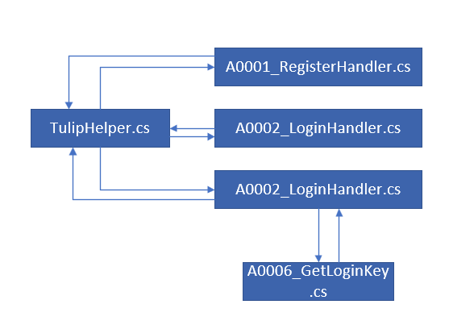

* **登录注册逻辑**
  
  * UI
    
    有关脚本
    
    > UIEventType.cs
    > 
    > TulipLobbyFactory.cs
    > 
    > TulipLobbyComponent.cs
    
    UIEventType.cs：注册创建UI的事件去调用TulipLobbyFactory
    
    TulipLobbyFactory.cs：创建UI的事件给UI添加TulipLobbyComponent组件
    
    TulipLobbyComponent.cs：获取UI中的信息，给登录/注册按钮添加事件
  
  <!--more-->
  
  * 网络
    
    
    
    有关脚本
    
    > - 前端
    >   
    >   TulipHelper.cs
    > 
    > - 后端
    >   
    >   - Realm
    >     
    >     A0002_LoginHandler.cs
    >     
    >     A0001_RegisterHandler.cs
    >   
    >   - Gate
    >     
    >     A0006_GetLoginKey.cs
    >     
    >     A0003_LoginGateHandler.cs
    
    TulipHelper.cs：不多说，向Realm发送登录{account,password}和注册请求{account,password}；发送登录后接收到Realm服的Gate服ip地址和Key后向Gate服发送登录请求{key}
    
     
    
    A0002_LoginHandler.cs：
    
    > 接收C登录请求{account,password}
    > 
    > 判断账号密码是否合法
    > 
    > 如果合法发给G{UserId}请求Key
    > 
    > 回复C{GateIP,Key}
    
    A0006_GetLoginKey.cs：
    
    > 接收R{UserID}
    > 
    > 利用UserID在SeesionKeyComponent中绑定UserId和Key
    > 
    > 回复R{Key}
    
    A0001_RegisterHandler.cs:
    
    > 接收C注册请求{account,password}
    > 
    > 判断账号是否合法
    > 
    > 如果合法将AccountInfo和UserInfo保存到数据库
    > 
    > 回复C{注册成功}
    
    A0003_LoginGateHandler.cs：
    
    > 接收C登录请求{key}
    > 
    > 验证Key合法性
    > 
    > 如果合法将UserId和Key解绑
    > 
    > 使用UserId创建User
    > 
    > 添加User到UserComponent
    > 
    > Session添加SessionUserComponent 绑定Seession和User
    > 
    > Session添加MailBoxComponent 通过MailBox进行actor通信
    > 
    > 设置User的参数GateAppID，GateSessionID，ActorID
    > 
    > 回复C{UserID}
