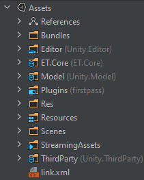
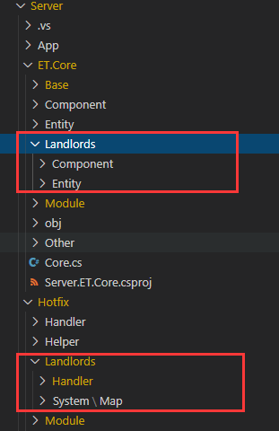
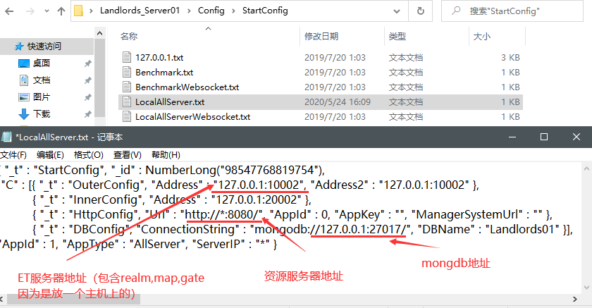

**ET版本5.0**

**项目文件与配置文件**

* 前端
  
  

（关注）Bundles：制作的AssetBundles资源放在这个目录。

（不关注）Editor：是自定义的一些unity编辑器中使用的一些扩展工具。

<!--more-->

（核心网络库）ET.Core：是ETCore框架的核心代码库，前后端相同并共用的。

（当然关注）Model：是当前游戏项目本身的全部代码，是自己项目的代码。

（不关注）Plugins：Unity生成的为游戏发布到各平台而准备的插件。

（关注）Res：一些Config文本文件，FairyGUI导入的原始素材

（不关注）Resources：游戏预制体目录

（关注）Scenes：项目的场景文件

（不关注）ThirdParty：需要用到的第三方C#调用库，mongo，Litjson，Google.Protobuf，FairyGUI

* 后端
  
  

（关注）App项目：ETCore网格框架的启动项目，里面只有一个Program.cs文件

（关注）HotFix项目：后端的System与Handler代码，是我们项目后端主要的开发阵地，主要是调用ET.Core项目中的组件和类，来使用全部逻辑与同步请求及返回

（关注）ET.Core项目：ETCore网络框架的核心组件与类，自己项目的功能组件与实体和其它类。

   后端配置文件



**重要知识点**

* ETCore的使用

Unity项目中，只需要要包含ET.Core项目（核心，与服务端代码一样），就能使用ET来进行网络请求与通信，Model项目中包含了少量现成提供可复用的组件，自己游戏的代码可以放在Model中，也可以另外创建一个项目引用ET.Core与Model即可。

需要引用ThirdParty项目，这里有mongo,protobuf,fairgui这些第三方sdk。

服务端项目中，系统逻辑与Handler都在Hotfix项目中编写，你自己项目的服务端代码主要在这里。后端ET.Core项目中可以加自己游戏的实体，组件，系统类。

Handler是请求的响应，与功能逻辑实现的地方。System是组件的扩展方法，来帮助把需要的组件加入到系统的生命周期里（start,load,awake,update等）。

消息指令与消息体在ET.Core项目中 \ET.Core\Module\Message\目录下。

* Session使用

用地址创建session 

远程地址：127.0.0.1:10002

```C#
Session sessionRealm = Game.Scene.GetComponent<NetOuterComponent>().Create("127.0.0.1:10002");
Session sessionRealm = Game.Scene.GetComponent<NetOuterComponent>().Create(GlobalConfigComponent.Instance.GlobalProto.Address);
```

GlobalConfigComponent.Instance.GlobalProto.Address就是配置文件中获取到像上面的远程地址。

用IPEndPoint创建session 

public IPEndPoint(long address, int port);

```C#
IPEndPoint realmIPEndPoint = new IPEndPoint(Int64.Parse("127.0.0.1"),10002);
Session realmSession = Game.Scene.GetComponent<NetOuterComponent>().Create(realmIPEndPoint);
```

不需要返回发送消息 session.Send

Send方法的参数是一个消息体

```C#
realmSession.Send(new A0004_PlayerOnline_G2R() { UserID = user.UserID, GateAppID = config.StartConfig.AppId });
```

发送请求获得返回 session.Call

Call方法的参数是一个请求消息体，返回一个响应消息体

```C#
A1002_SetUserInfo_G2C SetUserInfo_Ack = (A1002_SetUserInfo_G2C)await SessionComponent.Instance.Session.Call(SetUserInfo_Req);
```

* 消息指令、消息体

消息体，是把消息内容的不同字段构建一个消息体类型的实例，用实例属性来使用消息数据。

ET是先用数据构建消息体实例，把消息对象序列化为json或profobuf数据进行传送，收到消息再反序列化为消息对象在程序中使用。

消息与handler命名参考举例：消息名需要先知道他是什么功能，再怎么往来。消息处理handler需要先知道从哪来，再是什么功能。方便开发时保持思路清晰。

[功能表达]+[往来] ：GetUserInfo_C2G，GetUserInfo_G2C

当然如果你更习惯统一：C2G_TestMessage

如果是IActorMessage ：Actor_MatchSucess_M2G

收到消息后处理handler ：M2G_MatchSucess_Handler

认证服务Realm：R ，网关服务Gate：G，地图服务Map：M，客户端Client：C

消息指令与消息体定义

message C2G_TestMessage // IRequest

请求名后面带上 // IRequest 这样生成的消息体就会继承IRequest

message G2C_TestMessage // IResponse

返回名后面带上 //IResponse 这样生成的消息体就会继承IResponse

```Json
//测试向服务器返回消息
message G2C_TestMessage // IResponse
{
    int32 RpcId = 90;
    int32 Error = 91;
    string Message = 92;
}
```

HotfixMessage.cs，HotfixOpcode.cs，InnerMessage.cs，InnerOpcode.cs，OuterMessage.cs，OuterOpcode.cs

> InnerMessage：不同服务之间通信消息
> 
> OuterMessage：前后端通信消息
> 
> HotfixMessage：前后端通信消息，无热更的ETCore来说与OuterMessage没区别

* 实体间Actor通信

理解为什么要用actor通信：

Entity.Id是实体的身份证号，instanceID是居住证号，实体instanceID是会换的，比如到了别的地图。actor系统会保存你的身份证和你在哪个地图的居住证。如果用居住证能找到你，就用instanceId把消息发给你了，如果找不到，就会用身份证找到你新的居住证，再把消息发给你。

```C#
 //网关上的user实体是不是变动的，加消息组件，没有参数也没有AddLoaction()
 user.AddComponent<MailBoxComponent>();
 //session实体是客户端与网关的连接session，向此实体发消息，会转发到客户端，加消息组件带MailboxType.GateSession参数
 session.AddComponent<MailBoxComponent, string>(MailboxType.GateSession);
 //room,gamer实体会迁移地图，加消息组件有AddLoaction()
 room.AddComponent<MailBoxComponent>().AddLocation();
 newgamer.AddComponent<MailBoxComponent>().AddLocation();
```

ET.Core事件

Handler特性

[MessageHandler(AppType.Gate)] 

UIFactory特性

[UIFactory(FUIType.SetUserInfo)]

创建实体或组件