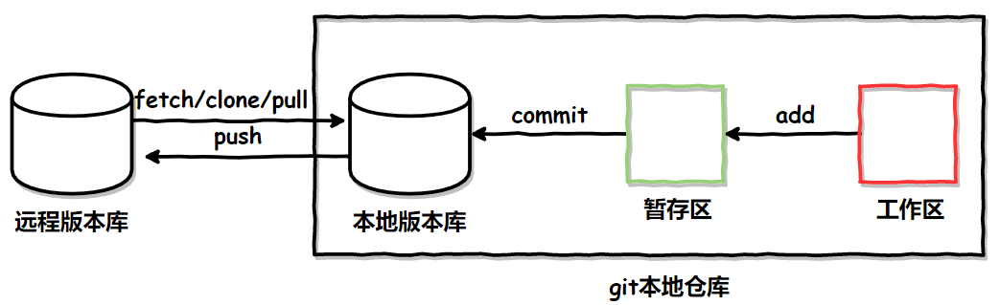

**常用的命令**

1. 克隆仓库
   
   ```bash
   $ git clone <repo> <directory>
   ```
   
   * repo:Git 仓库
   
   * directory:本地目录

<!-- more -->

* 初始化仓库
  
  ```bash
  $ git init <directory>
  ```
  
  * directory:本地目录

* 查看仓库状态
  
  ```bash
  $ git status
  ```

* 添加文件
  
  ```bash
  $ git add [file1] [file2] ...
  $ git add [dir]
  ```
  
  * file:文件
  * dir:文件夹

* 删除文件
  
  ```bash
  $ git rm [-f | --force] [-n] [-r] [--cached] [--ignore-unmatch] [--quiet] [--pathspec-from-file=<file> [--pathspec-file-nul]] [--] [<pathspec>…​]
  ```
  
  * f:覆盖最新的检测
  * n/dry-run:不在硬盘上删除文件，只在仓库中删除文件
  * r:递归删除文件夹
  * cached:使用此选项仅从索引中取消和删除路径。工作树文件，无论是否修改，都将保持不变
  * ignore-unmatch:即使没有匹配的文件，也会以0状态退出
  * q/quiet:不打印输出
  * pathspec:要删除的文件

* 移动文件
  
  ```bash
  $ git mv [-v] [-f] [-n] [-k] <source> <destination>
  $ git mv [-v] [-f] [-n] [-k] <source> ... <destination directory>
  ```
  
  * v/verbose:打印被移除文件的名称
  * f/force:强制覆盖目标文件
  * n/dry-run:只说明会做什么
  * k:跳过重命名

* 比较状态
  
  ```bash
  $ git diff [file] 显示暂存区和工作区的差异
  $ git diff --cached/staged [file] 显示暂存区和上一次提交(commit)的差异
  $ git diff [first-branch]...[second-branch]
  ```

* 提交命令
  
  ```bash
  $ git commit -m [message]
  ```
  
  * message：可以是一些备注信息。

* 回退版本
  
  ```bash
  $ git reset [--soft | --mixed | --hard] [HEAD]
  ```
  
  * mixed：为默认，可以不用带该参数，用于重置暂存区的文件与上一次的提交(commit)保持一致，工作区文件内容保持不变
  * soft 参数用于回退到某个版本
  * hard 参数撤销工作区中所有未提交的修改内容，将暂存区与工作区都回到上一次版本，并删除之前的所有信息提交

* 分支相关
  
  ```bash
  \#列出本地所有分支
  git branch
  \#列出所有远程分支
  git branch -r
  \#新建一个分支，但依然停留在当前分支
  git branch 分支名
  \#新建一个分支，并切换到该分支
  git checkout -b 分支名
  \#合并指定分支到当前分支
  git merge 分支名
  \#删除分支
  git branch -d 分支名
  \#删除远程分支
  git push origin --delete 分支名
  git branch -dr 分支名
  ```

**提交代码**

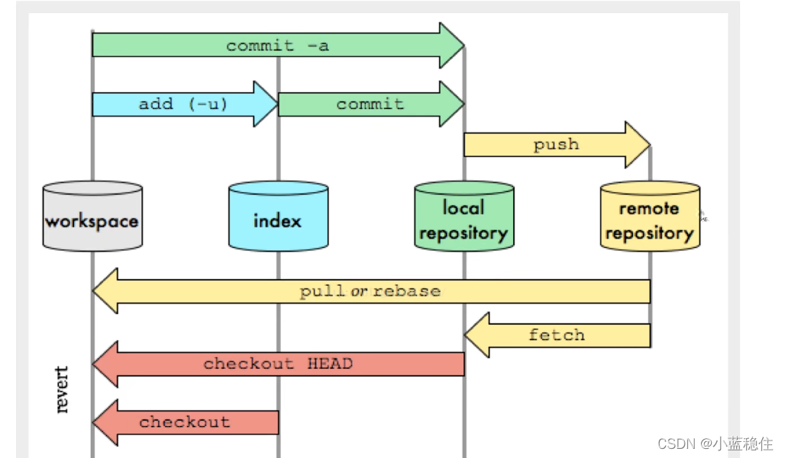

向Github提交代码的两种情况

1. 本地没有 Git 仓库，将远程仓库clone到本地
   
    通过clone命令创建的本地仓库，其本身就是一个 Git 仓库了，不用我们再进行
    init初始化操作啦，而且自动关联远程仓库。我们只需要在这个仓库进行修改或者
    添加等操作，然后commit即可。
   
   ```bash
   $ git clone "仓库地址"
   $ git push origin main
   ```

2. 本地有 Git 仓库，并且我们已经进行了多次commit操作
   
    进入仓库,关联远程仓库，origin为远程仓库的名字
   
   ```bash
   $ git remote add origin 仓库地址
   ```
   
    同步远程仓库和本地仓库
   
   ```bash
   $ git pull origin main
   ```
   
   强调:在向远程仓库提交代码的时候，一定要先进行pull操作，再进行push操作，防止本地仓库与远程仓库不同步导致冲突的问题，尤其是第二种提交代码的情况，很容易就出现问题。

**实际使用**

转载自[原文](https://blog.csdn.net/nrsc272420199/article/details/85219097)
1.远程仓库只有一个master分支的情况
   需要用到的命令

```bash
git pull----------------从远程仓库拉取代码到本地
git stash---------------将你修改后的代码存储到本地(一个栈结构)-->一般会在git pull码失败时使用
git stash pop-----------将你stash到本地的代码与重新git pull下的代码合并
git add XXX-------------将XXX文件加入到暂存区
git commit -m "注释"----将暂存区的文件提交到本地仓库
git push----------------将本地仓库的内容推送到远程仓库
```

2. 实际场景
   假设开发者A和开发者B都刚刚从远程仓库checkout了一份代码到本地.

A:
首先开发者A在README.md文件中进行了如下修改:

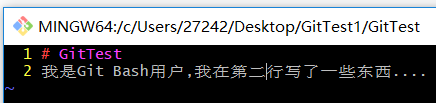然后将修改内容按照如下方式提交到远程仓库:
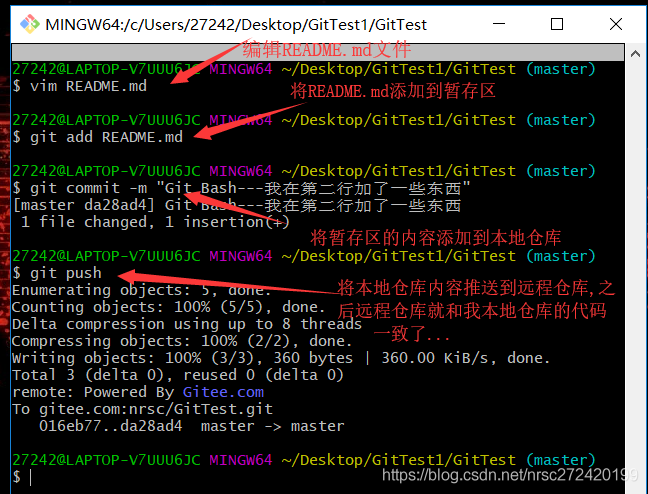

B:
 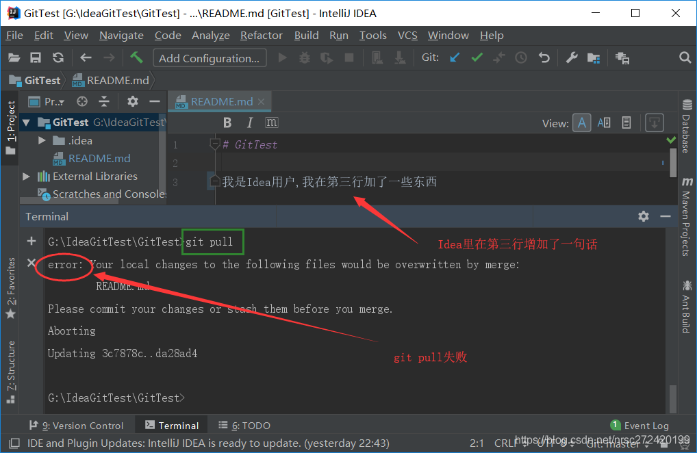  开发者B此时也要开发代码了,正常来讲,如果开发者B在开发完一个功能需要提交代码之前,肯定要git pull一下代码.比如说开发者B在README.md的第三行里增加了一句话,然后他去git pull代码,结果如下:

**★注意点1★–git监控变化的单位是文件**
   我不知道大家在这里会不会疑惑,反正我疑惑过很久,明明我在Git Bash里改动的是第二行,在Idea里改动的是第三行,不是说git监测的是变化吗?这里怎么就pull不下来呢?其实git所谓的监控变化,监控的单位是文件,也就是说假如其他开发者改动了XXX文件,并且同步到远程库了,你即使在XXX文件里改动了一个标点,加了一个空格,都无法pull成功.
   git pull不成功时,你就需要使用git stash命令了,具体解决方式如下:

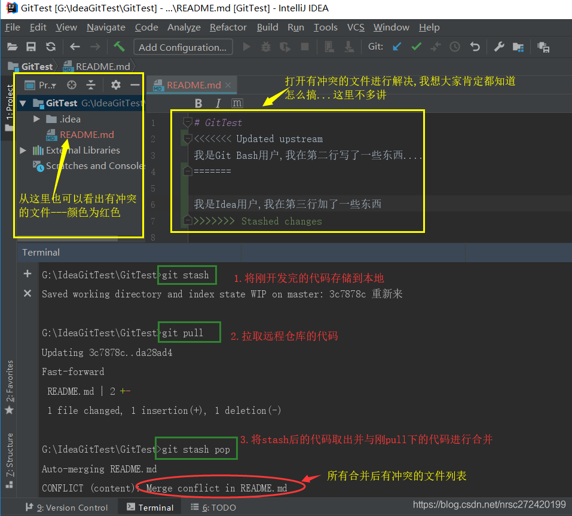

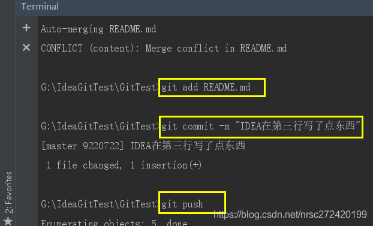

**★注意点2★–git pull可以把所有你上次push后没操作的文件pull下来**
A:
  接着上面的栗子,假设Git Bash用户同步了服务端的代码,并且在没跟IDEA用户商量的情况下,擅自修改了IDEA用户的代码,如下:

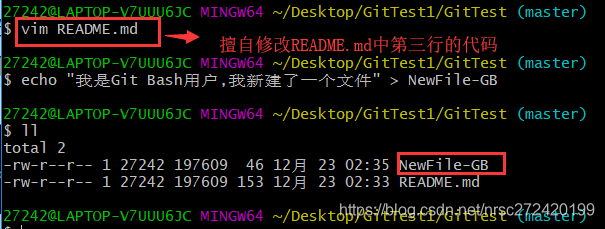
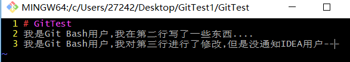  并且Git Bash用户还创建了一个新的文件,如下:

B:
  开发者B如果没有进行开发,或者进行了其他文件的开发,而未对README.md文件进行操作,直接git pull,效果见下图.可以发现,git pull可以把所有你上次push后没操作的文件pull下来,并将你本地的代码变成和远程仓库一样的代码.

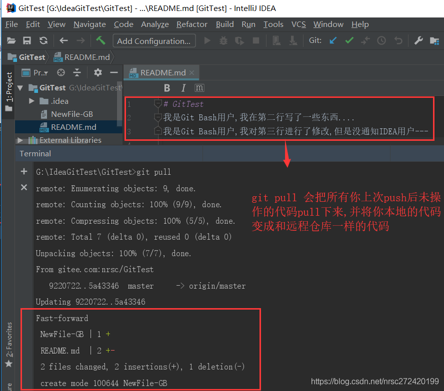所以奉在pull代码的时候一定要多注意看一下代码有没有被改动过.

3.使用idea的Update Project代替git pull + git stash +git stash pop

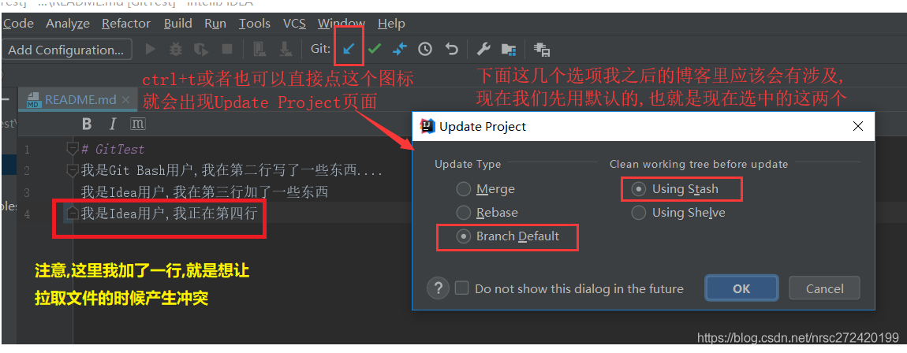然后点击一下OK,就会弹出如下页面:

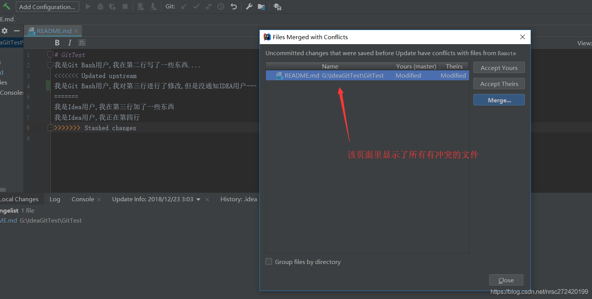   然后双击一下有冲突的文件之后,就会弹出如下页面,自我感觉在这个界面里进行冲突解决,要比注意点1中第一个图,那种解决方式爽一些.

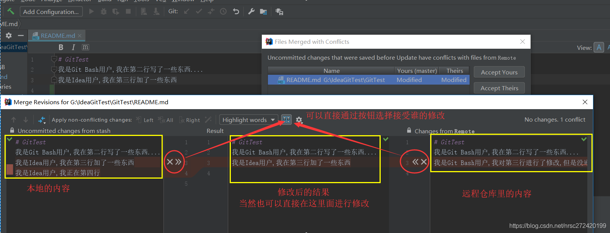并且解决完冲突后,立刻会弹出如下提示:

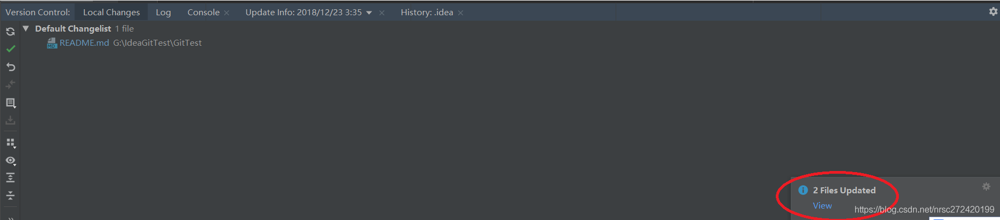点开提示之后,你就可以看到哪些文件修改了,哪些文件是新增的,而且你肯定会想去看看你原来操作过的文件有没有被updated过,从而避免注意点2中提到的情况.
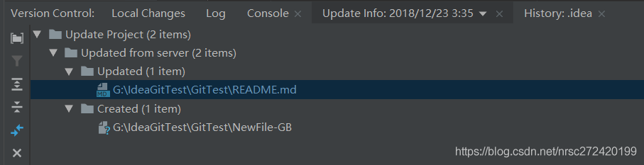

**git merge 相关**

1. 在分支之后未对代码修改
   
   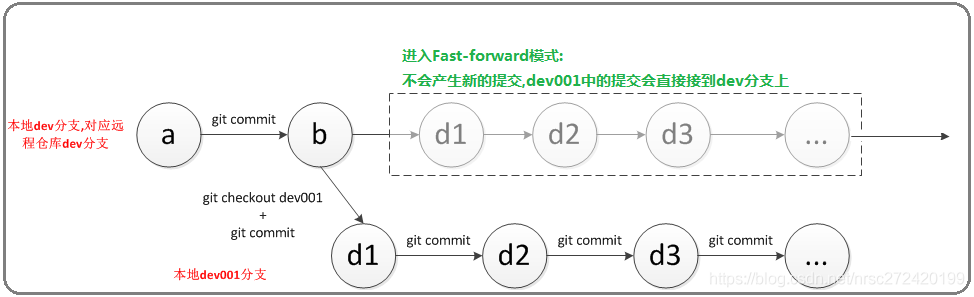

2. 在分支之对代码修改
   
   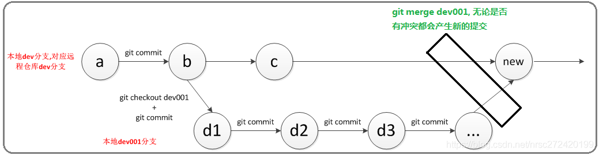
