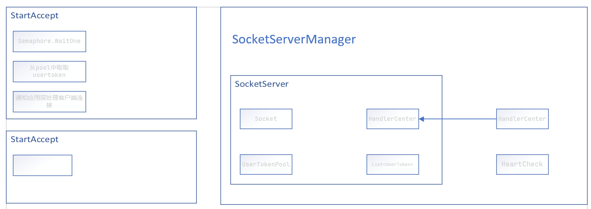

# 解决方案Spsever

## 大致流程

实例化SocketServerManager启动创建

SocketServer负责管理和监听Socket

HeartCheck负责对比UserToken的时间查看是否掉线

HandlerCenter负责处理客户端发来的数据包

## 涉及的内容

### 服务端

创建Socket，绑定por，Listen，Accept

Aceept、Receive采用SocketAsyncEventArgs 

## 
