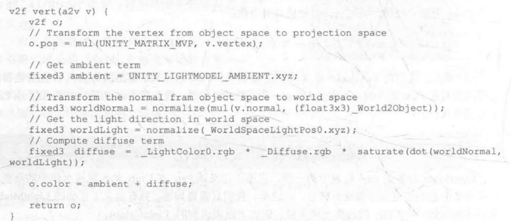

# Shader中遇到的一些问题

## 颜色相乘和相加

最近在写Shader得过程中突然意识到自己不知道颜色什么时候要相乘，什么时候要相加       

这一段中求漫反射光线的代码中是漫反射的光、物体自身的光、物体表面法线和环境光的法线的点积的归一的成绩  

**颜色相乘**是互相影响的颜色，两个光的相乘往往代表的是 光强x光反射或者光反射x光强 或者光反射x光反射。结果光发生了衰减或者反射能力发生了变化。例如求漫反射的时候是有用到光源的RGB*自身的RGB。光源的RBG代表的是光的强度。自身的RGB代表的是物体自身的反射率。在仅仅考虑光源的情况下，光源的RGB为(0.5,0,0)，而物体的RGB(1,0,0)，那么物体实际上显示的颜色为(0.5,0,0)，如果物体的RGB为(0,1,0)，那么物体的颜色为(0,0,0)。所以非光源物体显示什么颜色是由光源和自身的反射率共同作用的结果。

**颜色相加**是互不影响的颜色，两个光相加往往代表光的合并，例如绿光（0，1，0）经过某点A【RGB(0.3,0.5,0.2)】反射后变成了(0,0.5,0),红光（1，0，0）经过某点A的反射后变成了(0.3,0,0)，那么着两个光投射到眼睛的时候实际上是两个光的合并。例如Shader中物体的最终颜色=环境光+自发光+漫反射+高光。
