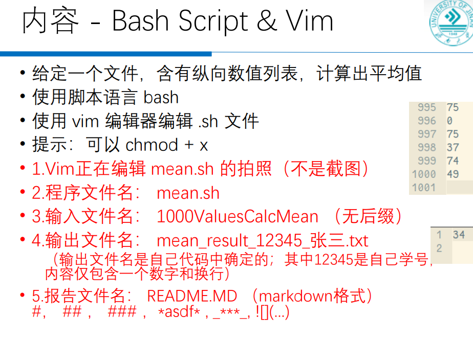
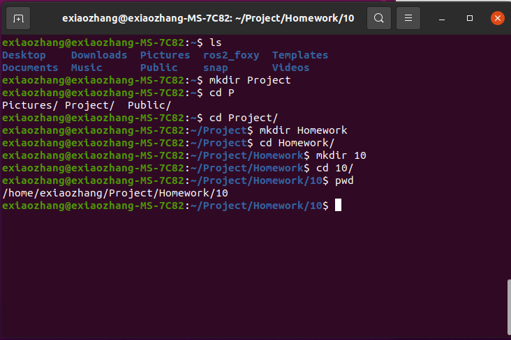
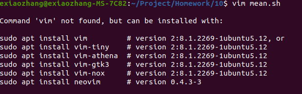
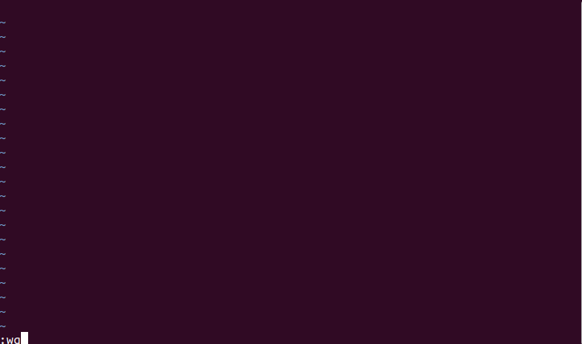
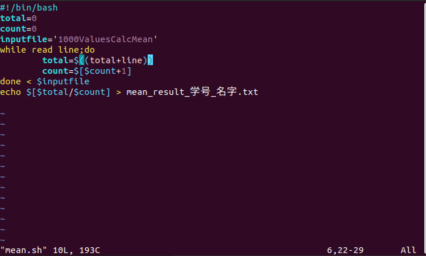
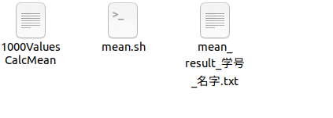
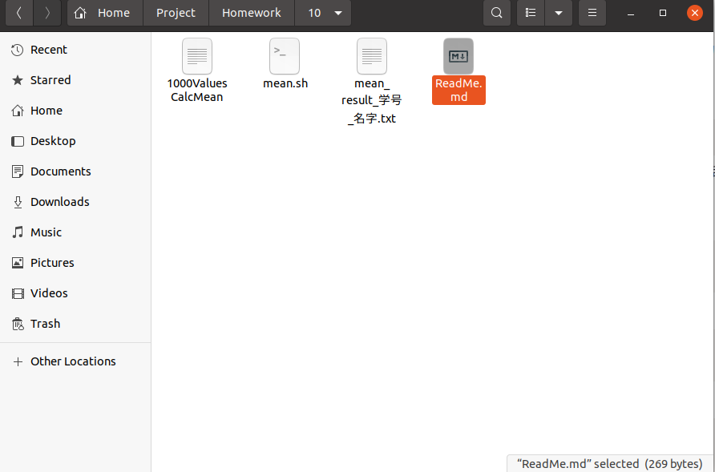
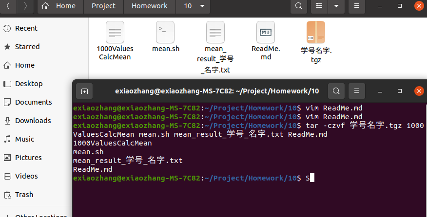
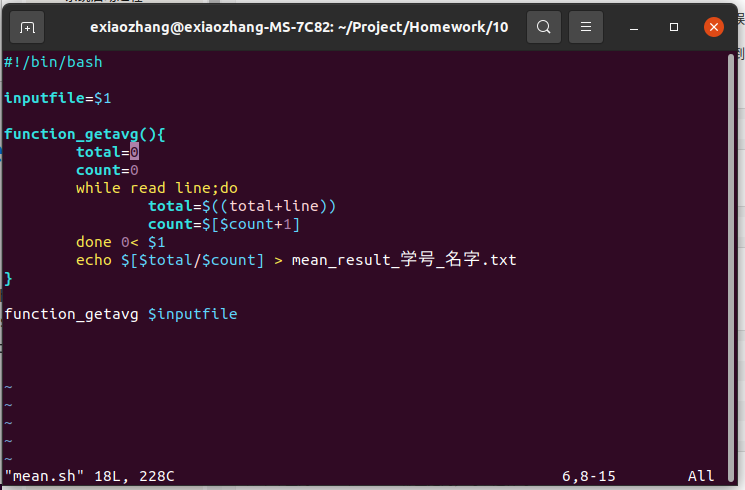

# 第一次实验

## 实验基本要求

  

<!--more-->

## 写取平均值脚本

  创建项目文件

  

```bash
mkdir Project //在用户目录下（~）创建Project文件夹
cd Project/  
mkdir Homework //在Project目录下创建Homework文件夹
cd Homework/
mkdir 10 //此时实验的项目地址
cd 10
```

     

  使用vim创建mean.sh文件

```bash
vim mean.sh 
```

  如果出现这种情况
  

```bash
sudo apt install vim
```

  安装完后在执行vim mean.sh，执行完后界面为

  

    按i键进入插入模式

  输入代码

```bash
#!/bin/bash
total=0
count=0
inputfile='1000ValuesCalcMean'
while read line;do
    total=$((total+line)）
    count=$[$count+1]
done < $inputfile
echo $[$total/$count] > mean_result_学号_名字.txt
```

      

  输入完后按esc键退出插入模式，输入:wq退出vim

```bash
sudo chmod 777 mean.sh //给mean.sh权限
./mean.sh              //执行mean.sh
```

  执行完后10文件夹内出现 mean_result_学号_名字.txt 文件

  

  内容为 平均数

  创建ReadMe.md

```bash
vim ReadMe.md
```

  进入后直接:wq退出

  

  看到文件夹内多出了文件ReaMe.md，双击

  

  在文本编辑器内写入以下示例后保存

  

  打包成.tgz格式的压缩包(别忘了传图片)

```bash
tar -czvf 压缩包的名字.tgz 你要压缩的第一个文件 第二个 ....
```

  

  进入学习通上交即可

## 进阶要求

  代码修改为

  

  执行命令改为

```bash
./mean.sh 1000ValuesCalcMean
```

  执行完后压缩上交即可(别忘了在ReadMe中说明使用了进阶要求)

# 第二次实验

## 实验要求

  

  基本要求只需要配置SCP和NFS，配置SCP和NFS的文件时候添加上自己的学号截图，使用SCP和NFS的时候截图并放在Word里,把word和压缩后的配置文件上交即可

## 配置SCP

  我使用的termux，就是老师发在群里的那个app

  如果你是第一次安装termux

```bash
//termux 上执行
apt update && apt upgrade 
```

  安装Openssh

```bash
//termux 上执行
pkg install openssh
```

  安装成功后可以测试ssh的连接

```bash
//termux

//给自己的用户设置密码
passwd
//打开ssh服务端
sshd

//ubuntu

ssh -p 8022 user@hostname_or_ip
//user是你在termux上的用户可以在termux上执行whoami查看
//host_or_ip是的你ip地址，确保你的termux和ubuntu在统一局域网下
//手机按wifi查看你的ipv4地址
//也可以在termux执行ifconfig查看wlan0网络适配器的inet
```

  连接成功后,在ubuntu上随便创建一个文件测试SCP,新开一个终端

```bash
//ubuntu

scp -P 8022 SourceFile user@hostname_or_ip:TargetPath
//SourFile是你要发送的文件
//TargPath是要发送到移动的路径，termux最好用当前用户的路径，例如./ (termux没有root用户权限)
//usr是termux的用户名
//host_or_ip是的你ip地址

//在你连接termux的ssh终端或者termux上查看文件是否发送过来，如果Target是./

ls ~
```

  截图保存

## NFS

我使用的是我购买的服务器，你可以采用windos和虚拟机，或者虚拟机之间通信

```bash
sudo apt-get install nfs-kernel-server #安装NFS服务器端
sudo apt-get install nfs-common        #安装NFS客户端
```

**在服务器上**

* 设置本地目录权限

```bash
sudo mkdir /nfs
sudo chmod -R 777 /nfs
```

* 添加目录的绝对路径到共享

```bash
vim /etc/exports
#添加
/nfs *(rw,async,no_subtree_check,no_root_squash)
#学号名字
```

* 启动NFS服务

```bash
sudo /usr/sbin/exportfs -arf 
sudo /etc/init.d/nfs-kernel-server start
```

**在客户端上**

* NFS服务测试

```bash
sudo mount -t nfs 192.168.12.123:/nfs /mnt -o nolock
#如果挂载成功，在/mnt目录下能看到/nfsroot目录下的内容
#如果你就一台电脑可以自己挂载自己把 192.168.12.123 改成 127.0.0.1
```

**截图,把exports复制一份**

## 提交

这样就完成的基本要求

* 把配置文件压缩

* 把图放到word，别忘加标题

* 把这个表复制到word


提交即可

## 进阶要求

可以参考我的git的使用

进阶没时间写了,找个其他时间再写

**这是我实验二的[文件](https://gitee.com/Exiaozhang/home-work_1/tree/master/19)包括了进阶要求的文件,可以参考着改改,不会可以线下问我,或者在我的评论区给我留言**
