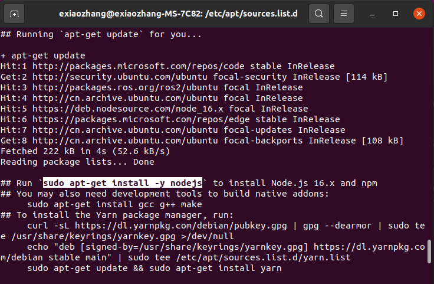

# 在Ubuntu中装Nodejs

```bash
curl -fsSL https://deb.nodesource.com/setup_18.x | sudo -E bash - &&\
sudo apt-get install -y nodejs
```


<!--more-->

结果报出GPG error:NO_PUBKEY 

* 首先我尝试了

```bash
sudo apt-key adv --keyserver keyserver.ubuntu.com --recv-keys YOURKEY
//把YOURKEY替换为报错提示的那个
```

* 继续执行安装代码，报出同样的错误
  
  

* 根据这个警告，判断apt可能没有信任deb.Nodesoure.com,执行以下代码

```bash
//找到这个仓库所在的sourelist,我是ubuntu20.4,路径可能不太一样，但都差不多
vim /etc/apt/sources.list.d/nodesource.list
//修改
deb [trusted=yes] https://deb.nodesource.com/node_18.x focal main
```

* 再次执行安装成功
  
  
