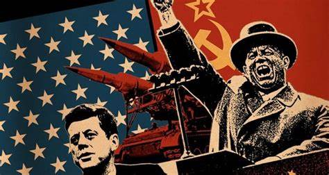

<!-- more -->

我的第一篇博客慢慢更新冷战历史

* 冷战的起源
  
  * 斯大林与1943年共产国际的解体
    
    &nbsp;&nbsp;1943年5月，作为世界革命大本营的共产国际（第三国际）突然宣布解散，这是国际共产主义运动历史上一件具有标志性的事件。就组织形式而言，第三国际是一个共产党世界性的统一机构，各国党只是它的一个支部。共产国际解散后，各国共产党都独立了。虽然到中苏分裂之前，国际共运还是以莫斯科为中心继续存在，但是其组织形式和活动方式发生了根本性改变——共产党情报局只是欧洲九国共产党的协调和指挥机构，而苏共二十大以后各国共产党都是通过召开会议来统一他们的政策和行动。就斗争任务而言，共产国际在理论和逻辑上始终以发动世界革命为己任，而在共产党情报局那里，所谓世界革命战略充其量只是莫斯科动员各国人民支持和援助苏联的口号，苏共二十大则明确提出了“和平共处”的外交路线。

**冷战热斗背景演讲**

<iframe 
src="//player.bilibili.com/player.html?aid=427826505&bvid=BV1YG411s7L1&cid=756709475&page=1" scrolling="no" border="0" 
frameborder="no" framespacing="0" allowfullscreen="true" style="position: absolute; width: 100%; 
height: 100%; left: 0; top: 0;"> </iframe>

