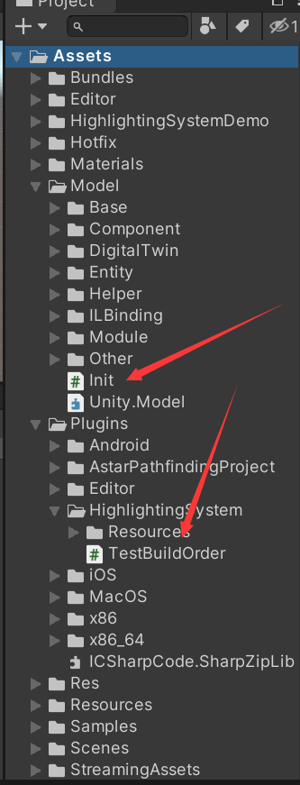
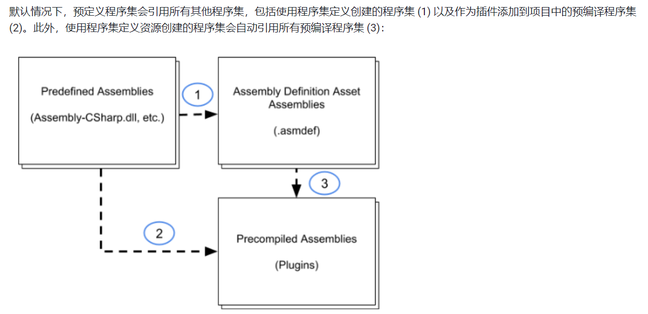

## Assembly Definitions编译顺序

最近遇到了这样一个问题,我在Assembly Definitions Model中想引用Plugins中.cs文件中类型结果提示缺少引用，

在unity找不到对应的引用

其实这是一个Unity编译顺序的问题

Plugins里的cs脚本如果没有程序集会被编译到 Predfined Assembiles，Assembly Definition是在Predfined Assembiles之前进行编译，所以无法引用，应该在在Plugins里面新建程序集让它编译到Precompiled Assemblies里面
