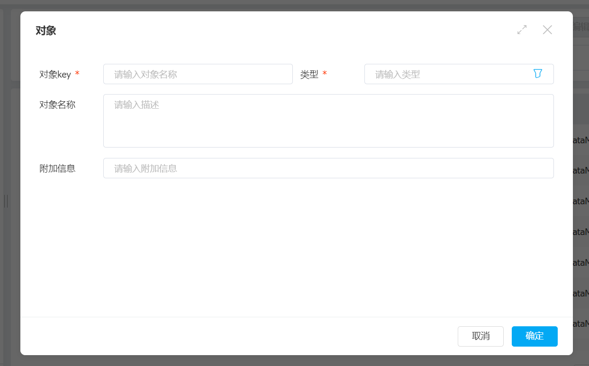

# 二开教程

## 字段

### 对象结构

当在对象管理器中建立对象时并在对象中添加字段时，对象的结构是这样的

id | data|object_key1|object_key2

实际上我们创建的对象是Mysql中的一行字段，其中data是json文件存储着我们没有映射到实体的字段

### 什么是映射实体字段，为什么要映射

映射实体字段就是把本来应该存储到data中的字段，放到这一行上预定义的字段上

因为非实体字段无法在Mysql中创建索引导致查询数据过慢

### 关联对象

关联对象实际上是关联对象模型的实体Id,这就是字段添加关联对象后类型都为整型的原因

## 码表

码表的作用和作用类似字典，码表其实是一种特殊的模型(对象)
