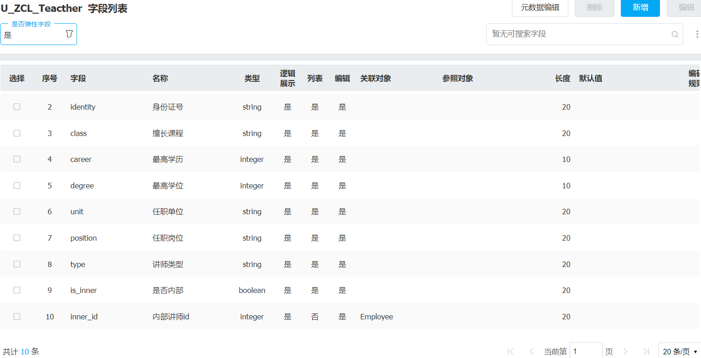

1.弹性模型规则 key：U_名字全拼大写_业务描述简称 
2.学习成绩 列表展示字段包含 人员、成绩、成绩等级【优良中差】（不可手填，需要配置码表）课程、任课老师 
3.课程 列表展示 课程编号、课程名称、课程开始时间、课程结束时间 课程状态 （启动、授课、结束） 最大开课人数 最大授课人数
4.讲师 列表展示 讲师名称、身份证号、擅长课程 、最高学历、最高学位、任职单位、任职岗位、讲师类型（当讲师类型是内部讲师需要拉取系统内部人员主任职信息到前面字段，外部讲师可手填）
5.课程报名 字段自己决定 需要体现出 谁（学员是内部人员）报名哪个课程 需要面向全员 报名 
    不能重复报名 
    不能报名没有讲师的课程 
    不能报名已结束或者未开始的课程 
    不能超过最大报名人数
    自己只能看到自己报名的课程，管理员可以看到全员的报名课程
    所有报名需要管理员审核
6.讲师报名授课 字段自己决定 
    不能超过所报课程的最大讲师人数
    同一个讲师不能报名授课同一时间段内的多个课程 
    所有报名需要管理员审核
7.学习成绩查看 学生在查看成绩时 需要同步看出 成绩 成绩等级 对应的课程 任课老师等信息（要求用主子表实现）

8.选做 讲师积分 课程结束后 根据学习成绩生成老师积分
    当该讲师教授课程的成绩等级 为优、良 占学员比例的80%及以上 的得10分 60%-80%得6分 50%-60% 得2分 50%以下不得分

三种角色：
1.管理人员 -角色 培训管理员 范围 所有组织 可以添加讲师（导入 注意校验内外部人员） 可以帮助员工报名课程（导入）可以新增或导入成绩 
2.讲师 普通员工 可以报名授课 
3.学生 普通员工 可以报名学习 查看成绩

## 对象结构


当在对象管理器中建立对象时并在对象中添加字段时，对象的结构是这样的

id | data|object_key1|object_key2

实际上我们创建的对象是Mysql中的一行字段，其中data是json文件存储着我们没有映射到实体的字段

## 什么是映射实体字段，为什么要映射

映射实体字段就是把本来应该存储到data中的字段，放到这一行上预定义的字段上

因为非实体字段无法在Mysql中创建索引导致查询数据过慢

## 关联对象

关联对象实际上是关联对象模型的实体Id,这就是字段添加关联对象后类型都为整型的原因

## 码表

码表的作用和作用类似字典，码表其实是一种特殊的模型(对象)

### 创建流程

系统设置->代码项管理->列表代码项


# 案例流程

## 创建学习成绩表

### 创建成绩等级码表

| 1   | 优   |
| --- | --- |
| 2   | 良   |
| 3   | 中   |
| 4   | 差   |

### 字段

人员 ：关联学生报名表

成绩 ：一般字段  

成绩等级 ：关联成绩等级码表

课程 ：关联教师报名表  

[06-03 主子模型功能配置 - HCM Cloud - Confluence](https://wiki.hcmcloud.cn/pages/viewpage.action?pageId=5801875#heading-1主子模型的说明)

由于学生查看到成绩后点击可以查看老师：这里需要实现一个主子模型，主子模型做了

成绩等级需要在成绩保持到表中执行一些逻辑得到成绩等级保存到表中：这里我知道要用form_relations来做还没看明白

## 创建课程表

### 创建课程状态码表

| 1   | 启动  |
| --- | --- |
| 2   | 授课  |
| 3   | 结束  |

### 字段

课程名称 ：一般字段

课程开始时间  ：一般字段

课程结束时间  ：一般字段，需要大于开始时间

课程状态 ：关联课程状态码表

 最大开课人数 ：一般字段

最大授课人数 ：一般字段

## 创建讲师表

### 字段

是否内部 ：一般字段  

内部讲师id:关联Employee表  

讲师名称 ：一般字段

身份证号 ：内部自动获取，外部手填 (不会)

最高学历 ：同上  

最高学位 ：同上  

任职单位 ：同上  

任职岗位 ：同上  

讲师类型 ：一般字段

擅长课程  ：一般字段

[Info元数据 - 产品研发 - Confluence (hcmcloud.cn)](https://wiki.hcmcloud.cn/pages/viewpage.action?pageId=2424907#Info元数据-form_relations时序图)



### Info元数据

```json
{
    "fields": [
        {
            "label": "讲师名称",
            "key": "name",
            "field": [
                "name"
            ],
            "data_type": "string",
            "object": null,
            "align": "left",
            "width": 100,
            "sequence": null,
            "fieldFunc": null,
            "format": null,
            "state": null,
            "is_blur": false
        },
        {
            "label": "身份证号",
            "key": "identity",
            "field": [
                "identity"
            ],
            "data_type": "string",
            "object": null,
            "align": "left",
            "width": 100,
            "sequence": null,
            "fieldFunc": null,
            "format": null,
            "state": null,
            "is_blur": false
        },
        {
            "label": "擅长课程",
            "key": "class",
            "field": [
                "class"
            ],
            "data_type": "string",
            "object": null,
            "align": "left",
            "width": 100,
            "sequence": null,
            "fieldFunc": null,
            "format": null,
            "state": null,
            "is_blur": false
        },
        {
            "label": "最高学历",
            "key": "career",
            "field": [
                "career"
            ],
            "data_type": "integer",
            "object": null,
            "align": "right",
            "width": 100,
            "sequence": null,
            "fieldFunc": null,
            "format": null,
            "state": null,
            "is_blur": false
        },
        {
            "label": "最高学位",
            "key": "degree",
            "field": [
                "degree"
            ],
            "data_type": "integer",
            "object": null,
            "align": "right",
            "width": 100,
            "sequence": null,
            "fieldFunc": null,
            "format": null,
            "state": null,
            "is_blur": false
        },
        {
            "label": "任职单位",
            "key": "unit",
            "field": [
                "unit"
            ],
            "data_type": "string",
            "object": null,
            "align": "left",
            "width": 100,
            "sequence": null,
            "fieldFunc": null,
            "format": null,
            "state": null,
            "is_blur": false
        },
        {
            "label": "任职岗位",
            "key": "position",
            "field": [
                "position"
            ],
            "data_type": "string",
            "object": null,
            "align": "left",
            "width": 100,
            "sequence": null,
            "fieldFunc": null,
            "format": null,
            "state": null,
            "is_blur": false
        },
        {
            "label": "讲师类型",
            "key": "type",
            "field": [
                "type"
            ],
            "data_type": "string",
            "object": null,
            "align": "left",
            "width": 100,
            "sequence": null,
            "fieldFunc": null,
            "format": null,
            "state": null,
            "is_blur": false
        },
        {
            "label": "是否内部",
            "key": "is_inner",
            "field": [
                "is_inner"
            ],
            "data_type": "boolean",
            "object": null,
            "align": "center",
            "width": 80,
            "sequence": null,
            "fieldFunc": null,
            "format": null,
            "state": null,
            "is_blur": false,
            "mask": [
                {
                    "key": true,
                    "name": "是"
                },
                {
                    "key": false,
                    "name": "否"
                }
            ]
        }
    ],
    "aggr": [],
    "statistics": [],
    "actions": [
        {
            "key": "flex_field",
            "label": "弹性字段",
            "action": "FLEX_FIELD",
            "left": true,
            "target": [
                "pc"
            ],
            "data": "U_ZCL_Teacther"
        },
        {
            "key": "setup",
            "label": "元数据配置",
            "action": "SETUP",
            "left": true,
            "target": [
                "pc"
            ],
            "data": "U_ZCL_Teacther.meta.list.json"
        },
        {
            "key": "new",
            "label": "新增",
            "action": "NEW",
            "icon": "icon-hcm-add-circle",
            "is_important": true
        },
        {
            "key": "edit",
            "label": "编辑",
            "default": true,
            "action": "EDIT",
            "left": true,
            "condition": "ITEM"
        },
        {
            "key": "delete",
            "label": "删除",
            "left": true,
            "action": "DELETE",
            "condition": "ITEM"
        },
        {
            "key": "print",
            "label": "打印",
            "action": "PRINT",
            "left": true,
            "hide": true,
            "condition": "ITEM"
        },
        {
            "label": "业务仓库",
            "key": "bizStore",
            "left": true,
            "action": "BIZ_STORE",
            "hide": true,
            "params": {
                "add_info": null
            }
        }
    ],
    "childs": [],
    "relations": [],
    "filters": [],
    "static_filters": [],
    "sorts": [],
    "conditions": {},
    "role": {},
    "default_filter_dict": {},
    "advance_query": {},
    "analyse": {},
    "list_config": {},
    "description": "教师信息",
    "data_plugins": [],
    "tree": {},
    "least_relations": null,
    "relation_mode": null,
    "count_async": null,
    "column_defs": {},
    "functional_state": [],
    "force_w": null,
    "extend": [],
    "hooks": {},
    "modi_state": null,
    "include": [],
    "force_fields": [],
    "execute_plan": [],
    "plugins": [],
    "meta_key": "U_ZCL_Teacther.meta.list.json",
    "model": "U_ZCL_Teacther",
    "state": null
}
```


## 创建学生报名表

### 字段

学生姓名 ：关联Employee（业务主键）

课程名称 ：关联教师报名表（业务主键）

状态 ：一般字段

不能重复报名：设置学生姓名和课程为业务主键

不能报名没有讲师的课程  ：不知道怎么做

不能报名已结束或者未开始的课程   ：不是很清楚

不能超过最大报名人数  ：不是很清楚

自己只能看到自己报名的课程，管理员可以看到全员的报名课程  ：做了

所有报名需要管理员审核：做了

## 创建教师报名表

### 字段

教师姓名 ： 关联讲师表

课程名称 ： 关联课程表

不能超过所报课程的最大讲师人数：不知道怎么做
同一个讲师不能报名授课同一时间段内的多个课程 ：不知道怎么做
所有报名需要管理员审核：做了

​            


## 一些问题

如何显示关联关联字段对象的名称

